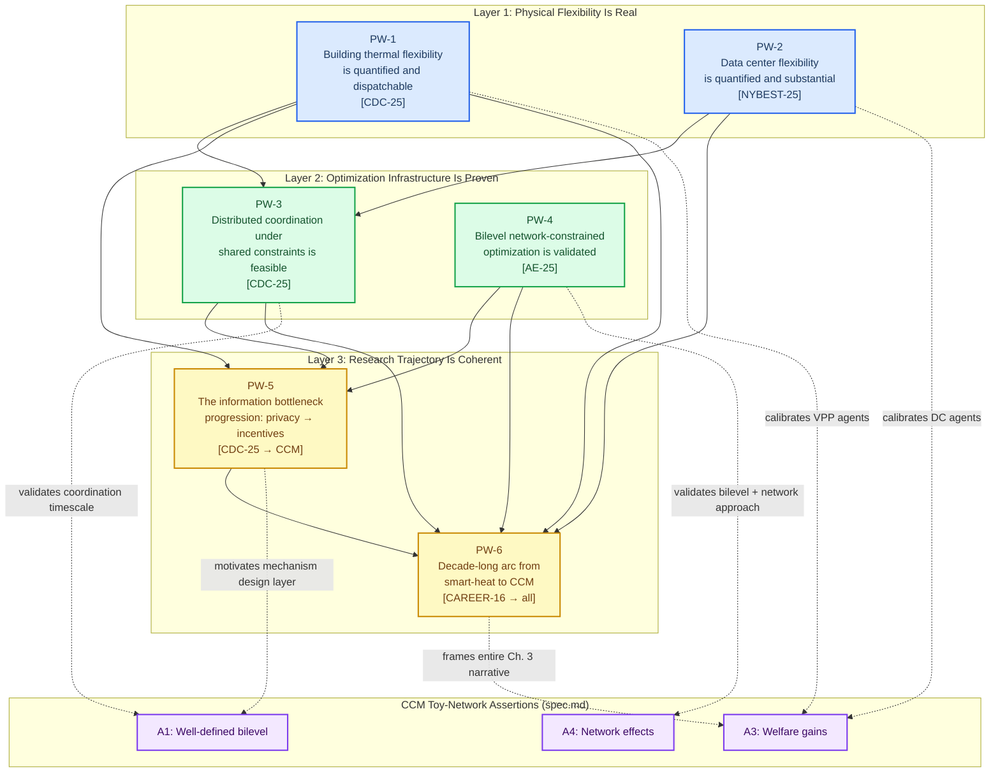

# Prior-Work Assertions Plan: Grounding the CCM Proposal in PI Zhang's Research Record

## Purpose

This document plans **prior-work assertions** for Chapter 3 (Research Plan / Preliminary Results) of the 2026 NSF EPCN proposal. These assertions are distinct from the five CCM toy-network assertions already planned in `spec.md`. Their function is different: where the toy-network assertions demonstrate that the *proposed mechanism* is mathematically sound, the prior-work assertions demonstrate that the *PI and lab* have the capability, trajectory, and physical-layer evidence to execute the plan.

The Argument Skeleton (principle #6) is explicit: *"Use preliminary data from your own work. Even a small analysis on a real dataset signals that you've already started and can execute."* A reviewer reading Chapter 3 should come away thinking not just "the math works on a toy problem" but "this group has been building toward this for a decade, and the physical systems they model are real."

---

## Source Materials

Four bodies of PI prior work feed into these assertions:

| Label | Work | Year | Venue | Key Contribution |
|-------|------|------|-------|------------------|
| **[CDC-25]** | Mahuze & Zhang, "Encrypted Coordination for Distributed Building Thermal Control" | 2025 | IEEE CDC (Rio de Janeiro) | ADMM-based distributed MPC for 4-building HVAC cluster under a shared power constraint. BFV homomorphic encryption for privacy. Co-simulation with EnergyPlus FMUs. Ithaca, NY case study. |
| **[AE-25]** | Mahuze, Amadeh, Yuan & Zhang, "Collaborative optimization framework for capacity planning of a prosumer-based peer-to-peer electricity trading community" | 2025 | Applied Energy 384, 125289 | Bilevel optimization (Borg MOEA upper / MINLP lower) for P2P trading community. Network-aware with voltage and line constraints. Demand flexibility via load shifting. 24.6% peak reduction through collaborative vs. individual planning. |
| **[NYBEST-25]** | Mahuze, Gressel & Zhang, "Towards AI Data Center Flexibility Assessment in the NY State Power Grid" | 2025 | NY-BEST Conference Poster | Bottom-up AI data center power model (8×H100 GPU cluster). Stochastic MPC for battery-based peak shaving of cooling loads. 34% mean / 46% best-case peak reduction across 20 scenarios. |
| **[CAREER-16]** | Zhang, "Smart-Heat Systems" | 2016 | NSF EPCN CAREER Proposal (awarded) | Concept of aggregated smart-heat systems providing grid services. Hierarchical control architecture. Virtual testbed based on Tompkins County, NY communities. |

---

## Prior-Work Assertion Map

Six assertions are organized into three layers. Layer 1 establishes that the physical flexibility underpinning the CCM is real and quantified. Layer 2 establishes that the PI's lab has demonstrated the computational and optimization infrastructure the CCM requires. Layer 3 synthesizes the intellectual trajectory, showing the CCM is a natural progression — not a pivot — from a decade of work.

---

## Layer 1: Physical Flexibility Is Real

### PW-1: Building Thermal Flexibility Is Quantified and Dispatchable

**Source:** [CDC-25] — Encrypted Coordination for Distributed Building Thermal Control

**Assertion:** *The PI's lab has demonstrated, through co-simulation with high-fidelity EnergyPlus models of four residential buildings in Tompkins County, NY, that coordinated HVAC control under a shared power constraint reduces cluster peak power by 41% (from 18.1 kW to 10.7 kW) and total energy cost by 4% ($21.4 → $20.6/day) while maintaining occupant comfort (17–23°C). This quantifies the physical demand flexibility that VPP-type agents would sell as Curtailment Credits in the CCM.*

**What to extract from [CDC-25] (plaintext, stripping encryption):**

- The 4-building cluster under uncoordinated MPC peaked at 18.1 kW, violating the 14.0 kW global limit. ADMM coordination brought this to 10.7 kW — a 7.4 kW reduction. This 7.4 kW is *marketable curtailment capacity*: the difference between what the buildings would consume without coordination and what they consume when actively flexing.
- The coordination maintained all zone temperatures within the 17.0–23.0°C comfort band. The flexibility comes at zero comfort cost — it is purely temporal shifting enabled by thermal inertia.
- The ADMM converged in approximately 8 iterations per 15-minute control interval (Figure 2 in [CDC-25]), with plaintext ADMM solving in 4.3 seconds per step. This puts the physical-layer coordination well within operational timescales.
- The three-tier TOU pricing (off-peak $0.065, mid-peak $0.145, on-peak $0.235/kWh) drives the economic incentive structure — the same kind of price signal that CCM credit prices would generate.

**How to present for the proposal (not a figure — a reframed interpretation):**

Translate the 7.4 kW cluster flexibility into CCM units. If a VPP aggregates 100 such 4-building clusters (400 homes), the marketable flexibility is approximately 740 kW per 15-minute interval. Scaled to the toy network's VPP-1 and VPP-2 agents (60 MW and 50 MW baseline loads with 40 MW curtailment obligations each), this grounds the obligation magnitudes: the 40 MW obligation for a VPP agent corresponds to aggregating thousands of thermally flexible homes, each contributing a few kW of shiftable load — exactly the order of magnitude [CDC-25] validates at the individual-cluster level.

**Relationship to other assertions:**

- PW-1 feeds directly into **CCM Assertion 3** (welfare gains) by providing physical evidence that the low-VOLL flexibility providers in the toy network are not hypothetical — the PI has measured and modeled the underlying thermal dynamics.
- PW-1 is a prerequisite for **PW-3** (distributed coordination feasibility): the flexibility demonstrated in PW-1 is what the coordination mechanism in PW-3 dispatches.
- PW-1 is a prerequisite for **PW-5** (information bottleneck progression): the ADMM coordinator in [CDC-25] needs aggregate power information to enforce the global constraint, which is the same structural information bottleneck that the CCM addresses through mechanism design.

---

### PW-2: Data Center Flexibility Is Quantified and Substantial

**Source:** [NYBEST-25] — Towards AI Data Center Flexibility Assessment in the NY State Power Grid

**Assertion:** *The PI's lab has developed a bottom-up AI data center power consumption model — combining GPU workload patterns, Markov-chain request arrivals, and Ornstein-Uhlenbeck stochastic processes — and demonstrated through stochastic MPC that battery storage achieves 34% mean peak shaving (25% worst-case, 46% best-case across 20 scenarios) on a representative cooling system. This quantifies the demand flexibility that data center agents could either retain (to reduce their own curtailment exposure) or sell into the CCM.*

**What to extract from [NYBEST-25]:**

- An 8×H100 GPU cluster (5.6 kW total capacity) consumes 22.45 kWh/day for inference (10.7% day-to-day variability) and 52.7 kWh/day for training (5.8% variability). The sharp difference in variability between inference and training workloads directly maps to the VOLL heterogeneity in the CCM: inference-heavy data centers have higher VOLL (interruption means real-time service failure) while training-heavy facilities have lower VOLL (jobs can be checkpointed and resumed).
- The stochastic MPC with a 1000 kWh battery and 250 kW discharge capacity reduced mean peak cooling load from 746 kW (baseline) to 496 kW — a 250 kW flexibility band. This flexibility band is what a data center could offer as curtailment absorption capacity if compensated through CCM credit payments.
- The battery achieves 90.2% round-trip efficiency, discharging 125 kWh during the critical peak event (hour 11) and recharging 138.5 kWh during off-peak periods. This charge/discharge cycle is the physical mechanism underlying a data center's participation as *both* a flexibility buyer (maintaining inference uptime) and a flexibility seller (offering battery-backed load reduction).
- The poster's stated next steps — scaling up based on planned AI data center projects in the NYISO queue and exporting consumption profiles to the NYGrid model — feed directly into the CCM proposal's Task 2.3 (scaling from 3-bus to reduced PJM/NYISO topology).

**How to present for the proposal:**

Cite [NYBEST-25] to calibrate the DC-1 and DC-2 agent parameters in the toy network. The poster's inference/training VOLL distinction provides empirical grounding for the 50,000/20,000 $/MWh split between DC-1 (inference) and DC-2 (training). The 34% peak-shaving result grounds the claim that data centers are not purely rigid loads — they possess meaningful flexibility that a well-designed market can unlock. The 3,000 MW of large loads in the NYISO queue (cited in the poster's motivation) provides the system-level urgency that mirrors the proposal's Section 2.1.

**Relationship to other assertions:**

- PW-2 feeds directly into **CCM Assertion 3** (welfare gains) by grounding the high-VOLL agents. Without PW-2, the DC-1 and DC-2 parameters are arbitrary numbers; with it, they trace to measured GPU workload profiles.
- PW-2 complements **PW-1** (building thermal flexibility). Together, PW-1 and PW-2 establish both sides of the CCM trade: PW-1 quantifies what sellers can offer (thermal load shifting), PW-2 quantifies what buyers can pay for (uninterrupted inference) and what they could also sell (battery-backed peak reduction).
- PW-2 supports **PW-6** (research trajectory) by showing that the PI's group has already begun modeling the specific load class — AI data centers — that motivates the entire 2026 proposal.

---

## Layer 2: Optimization Infrastructure Is Proven

### PW-3: Distributed Coordination Under Shared Constraints Is Computationally Feasible

**Source:** [CDC-25] — Encrypted Coordination for Distributed Building Thermal Control (plaintext ADMM results)

**Assertion:** *The PI's lab has demonstrated that ADMM-based distributed MPC coordinates four buildings under a shared 14.0 kW power cap with convergence in approximately 8 iterations per 15-minute control interval, completing in 4.3 seconds (plaintext). This validates that the physical-layer coordination underlying a CCM — dispatching flexible loads against a global constraint — operates well within real-time control timescales, and that the computational overhead of adding a market-clearing layer (which solves in under 1 second on the toy network) does not create a timing bottleneck.*

**What to extract from [CDC-25]:**

- The ADMM penalty parameter was ρ = 1.0, convergence tolerance ε = 10⁻², and maximum iterations 400. In practice, convergence was achieved in far fewer iterations (Figure 2 in [CDC-25] shows 8 iterations for time step 70).
- The coordinator architecture: a DSO generates keys and decrypts aggregates; the coordinator broadcasts dual variables and performs the global projection; each building solves its local MPC independently. Strip the encryption and this is exactly the architecture the CCM would use — a market operator (coordinator) enforces a global constraint (power cap → curtailment balance) while agents (buildings → market participants) optimize locally.
- The key structural observation: in [CDC-25], the coordinator needs only the *aggregate* sum $\sum_{i=1}^{N} P_{\text{hvac},i}$ to enforce the global constraint (Eq. 9b). It does not need individual $P_{\text{hvac},i}$ values. In the CCM, the market operator similarly needs only *aggregate* information (total curtailment balance, net injections at buses) to clear the market. Individual agents' private information (true VOLLs) need not be revealed — they are elicited through bids. The information-minimality principle is identical across both settings.

**How to present for the proposal:**

Frame this as a timing-feasibility argument for the full CCM pipeline. The complete pipeline is: (1) each building/agent solves a local optimization, (2) the coordinator/market operator solves a global clearing problem, (3) results are broadcast. [CDC-25] shows step (1) runs in seconds, and the CCM toy-network shows step (2) also runs in under 1 second. The total pipeline fits comfortably within a 15-minute control interval and could plausibly operate at 5-minute or even faster dispatch intervals — matching the timescale of real-time energy markets.

**Relationship to other assertions:**

- PW-3 depends on **PW-1** and **PW-2**: the feasibility of coordination only matters if there is real flexibility to coordinate (established by PW-1 and PW-2).
- PW-3 feeds into **CCM Assertion 2** (tractable MILP reformulation) by establishing that the physical-layer coordination timescale is compatible with the market-layer solve time.
- PW-3 is a prerequisite for **PW-5** (information bottleneck): the coordinator architecture and its information requirements set up the privacy-to-incentives intellectual transition.

---

### PW-4: Bilevel Network-Constrained Optimization Is Validated in the PI's Lab

**Source:** [AE-25] — Collaborative optimization framework for capacity planning of a prosumer-based P2P electricity trading community

**Assertion:** *The PI's lab has developed and validated a bilevel optimization framework for P2P electricity trading that accounts for network topology and constraints (voltage limits, line capacity), demand flexibility (load shifting), and the misalignment between system-wide and individual-adopter objectives. Collaborative optimization through this framework achieved 24.6% reduction in bi-monthly peak load versus 10.2% under individual planning, and cut the investment payback period from 5.1 to 1.8 years. This demonstrates the PI's expertise in the exact methodological core of the CCM: bilevel optimization with network feasibility constraints where a system operator and strategic agents pursue different objectives.*

**What to extract from [AE-25]:**

- The bilevel structure: the upper level uses Borg MOEA to reconcile system-wide objectives (maximize renewable use, minimize cost, ensure grid stability); the lower level uses MINLP with a dynamic SDR-based pricing mechanism for individual household decisions. This is structurally parallel to the CCM bilevel: upper level = CCM operator maximizing declared welfare subject to DC power flow feasibility; lower level = strategic agents maximizing individual payoff.
- Network awareness: [AE-25] explicitly models a radial distribution network, checks voltage constraints (ΔV_max from nominal) and line current limits (|I_l| ≤ I_max_l), and triggers re-optimization when violations are detected. The CCM toy-network's PTDF-based DC power flow constraints serve the same function at the transmission level.
- The collaborative-vs-individual comparison: 24.6% peak reduction (collaborative) vs. 10.2% (individual) demonstrates that coordinating agents through an appropriate mechanism captures substantially more value than letting agents optimize in isolation. This is precisely the CCM's core claim: welfare gains from coordinated trade (CCM Assertion 3 targets 85–100% of planner welfare vs. ~75% under autarky).
- The demand flexibility module: [AE-25] models load shifting with sensitivity coefficient α, time-shifting constraints, and shiftable vs. fixed load decomposition. This is the operational-level flexibility that CCM agents would trade.

**How to present for the proposal:**

Emphasize that the PI's group has already built and published a bilevel optimization framework with network constraints for an energy trading context. The CCM extends this prior capability in two specific directions: (1) replacing the evolutionary upper level with a welfare-maximizing LP/MILP that admits KKT reformulation and formal incentive analysis, and (2) replacing the lower-level MINLP with a strategic bidding model that enables mechanism design (VCG, incentive compatibility). These are extensions of a proven methodological base, not a new departure.

**Relationship to other assertions:**

- PW-4 feeds directly into **CCM Assertion 1** (well-defined bilevel) and **CCM Assertion 4** (network effects) by showing the PI has published, peer-reviewed experience with bilevel formulations under network constraints.
- PW-4 complements **PW-3** (distributed coordination) at a different scale: PW-3 validates real-time control timescales (minutes), PW-4 validates planning/market-clearing timescales (hourly to seasonal). Together they cover the full temporal spectrum of CCM operations.
- PW-4 is a prerequisite for **PW-5** (information bottleneck): the [AE-25] framework assumes the operator knows household preferences (α parameters). The CCM relaxes this assumption — agents are strategic — which is precisely the gap PW-5 articulates.

---

## Layer 3: Research Trajectory Is Coherent

### PW-5: The Information Bottleneck Progression — From Privacy to Incentives

**Source:** Intellectual bridge from [CDC-25] to the CCM

**Assertion:** *The PI's prior work on encrypted distributed coordination [CDC-25] solved the privacy dimension of the information bottleneck in building-cluster coordination: the coordinator enforces a global constraint without observing individual buildings' power consumption. The proposed CCM addresses the complementary incentive dimension of the same bottleneck: the market operator allocates curtailment efficiently without observing agents' true willingness to pay. In [CDC-25], the solution was homomorphic encryption. In the CCM, the solution is mechanism design (VCG payments). Both share the same structural principle — the coordinator requires only aggregate information to enforce the global constraint — but the threat model shifts from eavesdropping (adversary infers consumption patterns) to misreporting (strategic agent inflates or deflates declared value). This progression from privacy-preserving coordination to incentive-compatible coordination defines the intellectual core of the proposed project.*

**What this assertion requires (analytical, not computational):**

- A side-by-side comparison table showing the structural parallel:

| Dimension | [CDC-25] Encrypted ADMM | Proposed CCM |
|-----------|------------------------|--------------|
| Agents | Buildings with HVAC systems | Loads with curtailment obligations |
| Private information | Power consumption $P_{\text{hvac},i}$ | True VOLL $v_i$ |
| Global constraint | Aggregate power cap $\sum P_i \leq P_{\max}$ | Curtailment balance $\sum c_i = D$ + transmission limits |
| Coordinator needs | Aggregate $\sum P_i$ only | Aggregate curtailment + net bus injections only |
| Threat | Eavesdropping (semi-honest adversary infers $P_i$) | Misreporting (strategic agent inflates/deflates $b_i$) |
| Solution technique | BFV homomorphic encryption | VCG mechanism design |
| What coordinator never sees | Individual $P_i$ (encrypted) | Individual $v_i$ (private, elicited via bids) |
| Convergence guarantee | ADMM convergence (Proposition 3 in [CDC-25]) | Nash equilibrium / dominant strategy (VCG theory) |

- A narrative paragraph explaining why the progression is natural: once you have shown that a coordinator *can* operate on aggregate information alone (the [CDC-25] contribution), the next question is whether agents will *honestly supply* the information the coordinator needs. In [CDC-25], dishonesty was not modeled — the adversary was semi-honest (follows protocol but eavesdrops). In the CCM, agents are fully strategic (they choose what to report to maximize their own payoff). The CCM is therefore the game-theoretic completion of the coordination framework established in [CDC-25].

**How to present for the proposal:**

This should appear as a paragraph in the Chapter 3 transition between "PI's Prior Work" and "Proposed Research," framing the CCM not as a new topic but as the next logical step in a research program. The key sentence might be: *"Having established that distributed building coordination can enforce global constraints while preserving the privacy of individual power consumption data [CDC-25], we now ask: can the same coordination architecture elicit truthful participation from agents who are not merely privacy-sensitive but actively strategic? The CCM answers this question by replacing the encryption layer with a mechanism design layer — VCG payments that make honest reporting each agent's dominant strategy."*

**Relationship to other assertions:**

- PW-5 depends on **PW-1** (the flexibility is real), **PW-3** (the coordination architecture works), and **PW-4** (bilevel optimization is validated). It synthesizes all three into an intellectual narrative.
- PW-5 feeds into **CCM Assertion 1** (well-defined bilevel) and **CCM Assertion 5** (incentive compatibility) by motivating *why* the bilevel/VCG structure is necessary — it addresses a specific failure mode (strategic misreporting) that the PI's prior work exposed but did not solve.
- PW-5 is a prerequisite for **PW-6** (full trajectory), which wraps PW-5 into the broader decade-long arc.

---

### PW-6: The Decade-Long Arc from Smart-Heat to CCM

**Source:** Synthesis of [CAREER-16], [AE-25], [CDC-25], [NYBEST-25], and the 2026 CCM proposal

**Assertion:** *The proposed CCM represents the culmination of a decade-long research program by the PI. The 2016 CAREER award established that aggregated smart-heat systems with thermal storage can provide grid services (frequency regulation, demand response, peak reduction) — the physical-layer vision. Subsequent work quantified building thermal flexibility through co-simulation [CDC-25], validated bilevel network-constrained optimization for P2P energy trading [AE-25], and began modeling the new load class — AI data centers — that motivates the present proposal [NYBEST-25]. The CCM adds the missing layer: a market mechanism that coordinates these heterogeneous flexible resources under strategic behavior and transmission constraints. Each prior contribution supplies a necessary component of the CCM; no prior contribution alone is sufficient.*

**What this assertion requires:**

A timeline or progression diagram showing how each piece of prior work contributes a component to the CCM:

| Year | Work | Component Contributed to CCM |
|------|------|------------------------------|
| 2016 | CAREER proposal [CAREER-16] | **Vision**: aggregated flexible thermal loads as grid resources. Hierarchical control concept (building-level MPC + aggregator-level coordination). Virtual testbed approach grounded in real Tompkins County communities. |
| 2025 | Applied Energy [AE-25] | **Bilevel methodology**: network-constrained bilevel optimization where system-wide and individual objectives are jointly optimized. Demonstrated that collaborative coordination dramatically outperforms individual optimization (24.6% vs. 10.2% peak reduction). |
| 2025 | IEEE CDC [CDC-25] | **Coordination mechanism**: ADMM-based distributed coordination enforcing global power constraints across building clusters. Demonstrated real-time feasibility. Identified the information bottleneck (coordinator needs aggregates, not individual data). |
| 2025 | NY-BEST poster [NYBEST-25] | **New load class**: bottom-up modeling of AI data center power consumption and flexibility. Established that data centers are not rigid loads — battery storage and workload scheduling create substantial flexibility (34% peak shaving). Directly motivates the CCM's demand-side framing. |
| 2026 | **Proposed CCM** | **Market/incentive layer**: mechanism design (VCG payments, bilevel clearing) that elicits private valuations and allocates curtailment efficiently and fairly under transmission constraints. Combines the physical flexibility (PW-1, PW-2), coordination architecture (PW-3), and optimization methodology (PW-4) from prior work, adding the game-theoretic layer (PW-5) that none of the prior works addressed. |

**How to present for the proposal:**

This should appear early in Chapter 3, immediately after the Research Plan overview and before the task descriptions. A single paragraph tracing the arc, followed by a sentence like: *"The CCM is the mechanism design layer that sits atop the physical flexibility and coordination infrastructure the PI's group has developed over the past decade."* This signals to the reviewer that the PI is not learning new methods — the PI is applying a proven research program to a newly urgent problem (AI data center power demand + non-firm interconnection).

**Relationship to other assertions:**

- PW-6 depends on all five preceding assertions (PW-1 through PW-5) and integrates them into a single narrative.
- PW-6 feeds into the framing of the entire Chapter 3. It is not cited as a standalone numerical result but as the connective tissue that gives the reviewer confidence in the PI's ability to execute.

---

## How Prior-Work Assertions Interact with the CCM Toy-Network Assertions

The two assertion sets serve different rhetorical functions and should appear in different parts of Chapter 3:

| Assertion Set | Rhetorical Function | Placement in Chapter 3 |
|---------------|--------------------|-----------------------|
| **PW-1 through PW-6** | "This PI can execute and has been building toward this." | Section 3.1 (Overview / Prior Work) — before task descriptions |
| **A1 through A5** (from spec.md) | "The proposed mechanism is mathematically sound and produces the claimed results." | Sections 3.2–3.4 (within specific task descriptions) — as embedded preliminary results |

The prior-work assertions provide the *foundation* on which the CCM assertions rest:

- **PW-1 + PW-2** → calibrate agent parameters → strengthen **A3** (welfare gains are grounded in real flexibility, not arbitrary numbers)
- **PW-3** → validates coordination timescale → strengthen **A2** (MILP solve time is compatible with operational dispatch)
- **PW-4** → validates bilevel + network approach → strengthen **A1** (bilevel formulation) and **A4** (network effects matter)
- **PW-5** → motivates the incentive layer → strengthen **A5** (VCG incentive compatibility is the answer to a specific, identified gap)
- **PW-6** → frames the entire narrative → the reviewer's "overall impression" of the Research Plan

---

## Execution Notes

**What to produce:**

1. A "PI's Prior Work and Research Trajectory" subsection (approximately 1–1.5 pages) for Chapter 3 of the proposal, containing PW-1 through PW-6 woven into flowing prose (not a bulleted list of assertions).
2. A calibration note added to Table 1 (agent parameters) in `main.tex`, citing [NYBEST-25] for DC agents and [CDC-25] for VPP agents.
3. The structural comparison table (PW-5) rendered as a LaTeX table or embedded in the narrative.
4. An updated reference list including all four prior works.

**What NOT to produce:**

- No new computational results. PW-1 through PW-4 reuse published numbers from [CDC-25], [AE-25], and [NYBEST-25].
- No new figures. The proposal should cite figures from the published papers by reference, not reproduce them (page budget is tight).
- No pseudocode. The prior-work assertions are analytical and narrative, not computational.

**Relationship to the spec.md pipeline:**

The prior-work assertions plan is independent of the spec.md implementation pipeline. The spec.md pipeline produces the CCM toy-network results (A1–A5). This plan produces the framing narrative and calibration links. Both feed into the same Chapter 3, but they can be executed in parallel: one person (or Claude Code session) implements the toy-network code, while another drafts the prior-work narrative.

---

## Summary Table

| Assertion | Layer | Source | Claim | Strengthens |
|-----------|-------|--------|-------|-------------|
| PW-1 | Physical | [CDC-25] | Thermal flexibility: 41% peak reduction, 7.4 kW marketable capacity per 4-building cluster | A3 (welfare gains calibration for VPP agents) |
| PW-2 | Physical | [NYBEST-25] | DC flexibility: 34% peak shaving, inference vs. training VOLL distinction | A3 (welfare gains calibration for DC agents) |
| PW-3 | Computational | [CDC-25] | Distributed ADMM converges in 8 iterations / 4.3 sec under global power constraint | A2 (tractability), pipeline timing |
| PW-4 | Methodological | [AE-25] | Bilevel network-constrained optimization: 24.6% vs. 10.2% peak reduction, collaborative vs. individual | A1 (bilevel formulation), A4 (network effects) |
| PW-5 | Intellectual | [CDC-25] → CCM | Information bottleneck: privacy (encryption) → incentives (mechanism design) | A1 (motivates bilevel), A5 (motivates VCG) |
| PW-6 | Narrative | All | Decade-long arc: smart-heat → P2P trading → encrypted coordination → data center flexibility → CCM | Entire Chapter 3 framing |
